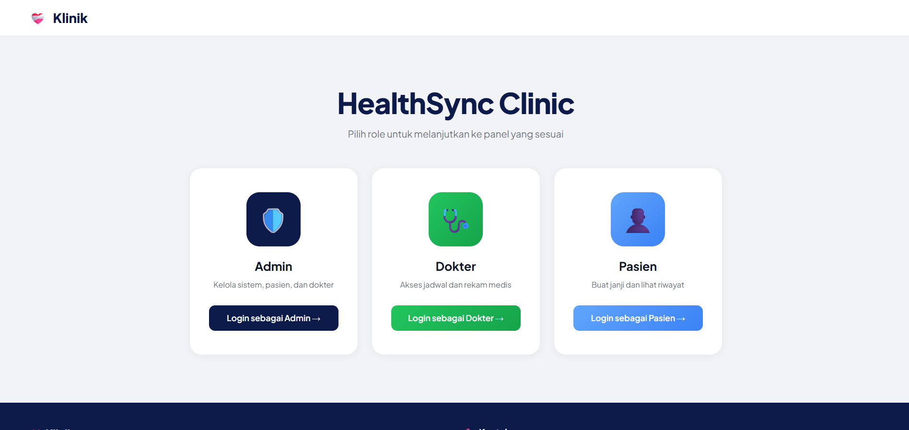

# PBL_206
Secure Mini Enterprise Infrastructure Deployment

# HealthSync Clinic

Full stack app of a clinic website



## URL Structure

```
/                          → Role Picker
/admin/login
/admin/dashboard
/admin/appointments
/admin/dokter
/admin/pasien
/admin/chat
/admin/chatCs
/admin/settings

/dokter/login
/dokter/lupaPassword
/dokter/jadwal
/dokter/riwayat
/dokter/rekamMedis
/dokter/kelolaJadwal
/dokter/chat
/dokter/profil
/dokter/settings

/pasien/login
/pasien/daftar
/pasien/lupaPassword
/pasien/resetPassword
/pasien/home
/pasien/cariDokter
/pasien/riwayat
/pasien/chatCs
/pasien/profil
/pasien/settings
```

## Project Structure

```
berkah@uiserver:~/PBL_206$ tree
.
├── backup.sh
├── client
│   ├── Dockerfile
│   ├── index.html
│   ├── nginx.conf
│   ├── package.json
│   ├── src
│   │   ├── App.jsx
│   │   ├── assets
│   │   │   └── qrisDefault.js
│   │   ├── components
│   │   │   ├── AdminSidebar.jsx
│   │   │   ├── DokterSidebar.jsx
│   │   │   ├── FotoAdjustModal.jsx
│   │   │   ├── NotifPopup.jsx
│   │   │   ├── PasienSidebar.jsx
│   │   │   ├── ProtectedRoute.jsx
│   │   │   ├── QRISModal.jsx
│   │   │   └── ReminderBanner.jsx
│   │   ├── index.css
│   │   ├── main.jsx
│   │   ├── pages
│   │   │   ├── admin
│   │   │   │   ├── Appointments.jsx
│   │   │   │   ├── ChatCS.jsx
│   │   │   │   ├── Chat.jsx
│   │   │   │   ├── Dashboard.jsx
│   │   │   │   ├── Dokter.jsx
│   │   │   │   ├── KlinikSettings.jsx
│   │   │   │   ├── Login.jsx
│   │   │   │   ├── Pasien.jsx
│   │   │   │   └── Settings.jsx
│   │   │   ├── dokter
│   │   │   │   ├── Chat.jsx
│   │   │   │   ├── Jadwal.jsx
│   │   │   │   ├── KelolaJadwal.jsx
│   │   │   │   ├── Login.jsx
│   │   │   │   ├── LupaPassword.jsx
│   │   │   │   ├── Profil.jsx
│   │   │   │   ├── RekamMedis.jsx
│   │   │   │   ├── ResetPassword.jsx
│   │   │   │   ├── Riwayat.jsx
│   │   │   │   └── Settings.jsx
│   │   │   ├── Index.jsx
│   │   │   └── pasien
│   │   │       ├── CariDokter.jsx
│   │   │       ├── ChatCS.jsx
│   │   │       ├── Daftar.jsx
│   │   │       ├── Home.jsx
│   │   │       ├── Login.jsx
│   │   │       ├── LupaPassword.jsx
│   │   │       ├── Mamoruchat.jsx
│   │   │       ├── Profil.jsx
│   │   │       ├── ResetPassword.jsx
│   │   │       ├── Riwayat.jsx
│   │   │       └── Settings.jsx
│   │   └── utils
│   │       └── api.js
│   └── vite.config.js
├── db_stack
│   ├── backup.sh
│   ├── db_praktikum.sql
│   ├── docker-compose.yml
│   ├── generate-tde-key.sh
│   ├── IMPLEMENTASI_BACKUP_TDE.md
│   └── migration_qris_dokter.sql
├── docker-compose.yml
├── env.example
├── healthsync_final.html
├── healthsync-tls-tutorial.md
├── MonitorPBL206.ps1
├── nginx
│   └── nginx.conf
├── README.md
├── server
│   ├── backup-strategy.md
│   ├── crypto.js
│   ├── Dockerfile
│   ├── ENKRIPSI_GUIDE.md
│   ├── index.js
│   ├── migrate_encrypt_existing.js
│   └── package.json
└── tutorial-prometheus-grafana.md
```

## Troubleshoot

### Quick Access
ssh dari wsl ke vm server
```
ssh -i /mnt/d/TLID_SSH_KEY/tlid -p 2223 berkah@192.168.56.105
# atau
ssh -i ~/.ssh/tlid -p 2223 berkah@192.168.56.105
```
fitur cepat update dari github + jalanin server
```
git pull --rebase && docker compose down && docker compose up --build -d
```
akses ke database mariadb
```
docker exec -it db-stack-db-1 mariadb -u root -p
```
akses ke browser
```
https://healthsync.web.id
```

### Git and Docker
nambahin fitur dari vm server
```
git add .
git commit -m "PESAN_BUAT COMMIT"
git pull --rebase
git push
```
ambil update dari github
```
git pull --rebase
```
download dari github
```
git clone https://<TOKEN>@github.com/berkahyanz17/PBL_206.git
```
set url remote biar bisa pull dan push
```
git remote set-url origin https://<TOKEN>@github.com/berkahyanz17/PBL_206.git
```
jalanin server
```
docker compose up -d
```
jalanin server + build
```
docker compose up --build -d
```
matiin server
```
docker compose down
```
matiin server + reset database
```
docker compose down -v
```
migrasi data lama ke data terenkripsi
```
docker exec -it pbl_206-server-1 node migrate_encrypt_existing.js
```

### Basic Vuln Scan
Trivy scan latest cve vulnerability
```
# Check images name
docker images

# Install trivy if not already
sudo curl -sfL https://raw.githubusercontent.com/aquasecurity/trivy/main/contrib/install.sh | sudo sh -s -- -b /usr/local/bin

# Scan
trivy image pbl_206-server:latest
trivy image pbl_206-nginx:latest
trivy image pbl_206-client:latest
```
#### Or other tools in kali linux also do for active vuln scan

### This is our project stack
Frontend |     Backend     | Database | Cache | Deployment | Reverse Proxy | Networking/Gateway
react.js + node.js express + mariadb  + redis +   docker   +     nginx     +     cloudflare

###### Thank you for reading to the end of the documentation
###### Made with ❤️ and ☕
